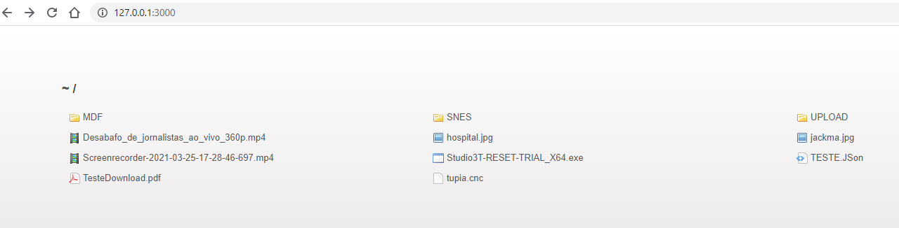
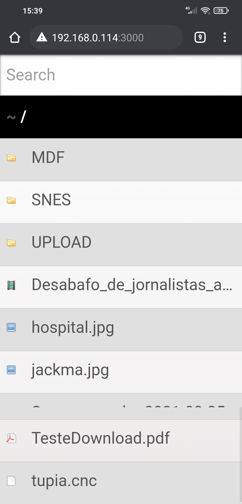

## DownloadUpload
> Javascript Server Downloads and Uploads on port `3000`.

## Requisitos Mínimos
- NodeJS v10.21.0.
- Browser Navigator.

## Install
- To Install run command in console: `npm i`.
- Dependencies modules javascript.
```
"devDependencies": {
    "nodemon": "2.0.7"
  },
  "dependencies": {
    "express": "4.17.1",
    "multer": "1.4.2",
    "serve-index": "1.9.1"
  }
```

## Start
- Run command in console to environment develop: `npm run startdev`.
- Run command in console to environment protuction: `npm run start`.

## Screen Dump

> Downloads show list files



> Form Upload files


> Show in mobile.

